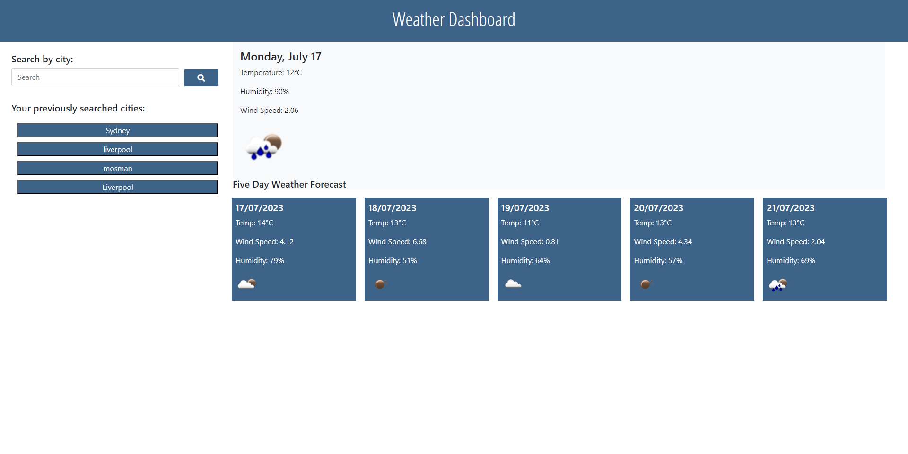
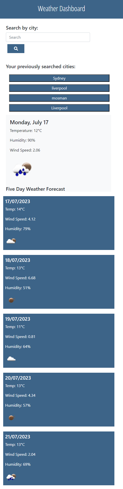

# 5 Days Weather Dashboard

## 5 Days Weather Dashboard Website
This repository was created to allow the users that are in the page to search the weather for today and next 5 days with the ability to view their search history of the cities that they have search for.

This project only contain one main page, the main page will contain Search bar with a search button, search history today's weather for the searched city and 5 days weather too.

This project is mainly focused on showing up my skills in JS third party API's that are available to use, and to improve on it as I progress through my learning journey.

## GitHub Repo URL
https://github.com/AllenHirmiz/5-Days-Weather-Dashboard

## Website URL
https://allenhirmiz.github.io/Agenda-Scheduler/Develop/

## Table of Contents
Header
Side section containing the search bar and history
Main section to display today's and next 5 days weather.

## Installation
Web Based
## Technologies Used
5 Days Weather Dashboard website is built using the following technologies:

HTML5: The structure and layout of the web pages.
CSS3: Styling and visual enhancements for an appealing user interface.
JavaScript: Dynamic and interactive elements, such as animations and form validation.
Local API's: allow developers to create complex functionality more easily
Third-Party API's (OpenWeatherMap & Bootstrap & DayJS): allow developers to access their Third-Party API's functionality via JavaScript and use it on your site (free or paid).
Git: Version control system for managing codebase changes.
GitHub Pages: Hosting service for deploying the website.
## Mock-Up

The following image shows the web application's appearance and functionality:

## Full screen size
Customers that are to view the website will be presented with a page that contain search bar, history and today & next 5 days weather. 

## Responsive Layout
The website is also designed to work on large and small screens like mobile.

